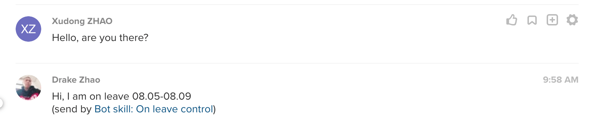

# on-leave-control-glip-bot-skill

Still under contruction....

On leave control bot skill for [ringcentral-personal-chatbot-js](https://github.com/ringcentral/ringcentral-personal-chatbot-js).




## Quick start

Let's start a simple chatbot server and login to it with you sandbox glip account, and you account will auto respond to any message with on leave notes set by you when you on leave.

```bash
# get the code
git clone git@github.com:rc-personal-bot-framework/on-leave-control-glip-bot-skill.git
cd on-leave-control-glip-bot-skill

# install dependecies
npm i
npm i --no-save ringcentral-personal-chatbot

# start proxy server, this will make your local bot server can be accessed by RingCentral service
npm run ngrok

# will show
Forwarding                    https://xxxx.ap.ngrok.io -> localhost:6066
# Remember the https://xxxx.ap.ngrok.io, we will use it later
```

Login to [developer.ringcentral.com](https://developer.ringcentral.com/) and create Web-based App:

- Application Type: Public
- Platform Type: Browser-based
- Carrier: accept the default values
- Permissions Needed: Accounts, Contacts, Glip, Glip Internal, Read Accounts, Read Client Info, Read Messages, Read Contacts, Read Presence, Webhook Subscriptions
- Set OAuth Redirect URI: Using your ngrok HTTPS URL from above, enter in the following value: `https://xxxx.ap.ngrok.io/rc/oauth`.

<a href="https://developer.ringcentral.com/new-app?name=Sample+Personal+Bot+App&desc=A+sample+app+created+in+conjunction+with+the+ringcentral+personal+bot+framework&public=true&type=BrowserBased&carriers=7710,7310,3420&permissions=Accounts,Contacts,Glip,GlipInternal,ReadAccounts,ReadClientInfo,ReadContacts,ReadMessages,ReadPresence,WebhookSubscriptions&redirectUri=" target="_blank">Click to create app</a>

```bash
cp sample.env .env
# then fill all required fields in .env, you can get client ID / secret from app setting

# run sample hello bot
npm start

# start client dev server
npm run c

```

Then visit [https://xxxx.ap.ngrok.io](https://xxxx.ap.ngrok.io) to login, after auth, you can set `Bot skill: FAQ`'s keywords and answers from its setting page. Then try the keywords with another account.

## Build and run in production

```bash
# build
npm run build

# run prodcution code
npm run p
# or
node -r dotenv/config bin/rcpf.js example-bots/hello.js

# proxy for production code
npm run ngrok-p
```

## How to use a bot skill

[https://github.com/rc-personal-bot-framework/ringcentral-personal-chatbot-js/blob/master/docs/write-use-a-skill.md](https://github.com/rc-personal-bot-framework/ringcentral-personal-chatbot-js/blob/master/docs/write-use-a-skill.md)

## Real bot using FAQ skill

[https://github.com/rc-personal-bot-framework/ringcentral-personal-bot-template-js](https://github.com/rc-personal-bot-framework/ringcentral-personal-bot-template-js)

## License

MIT
